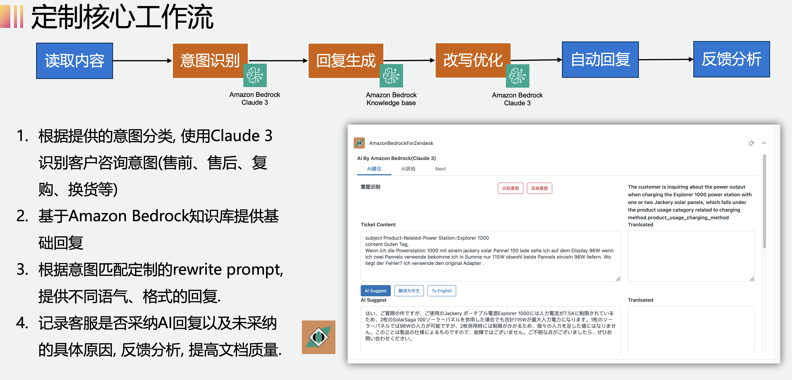
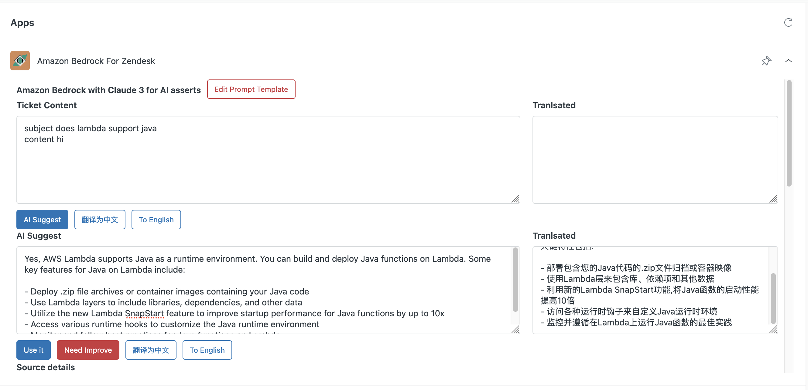
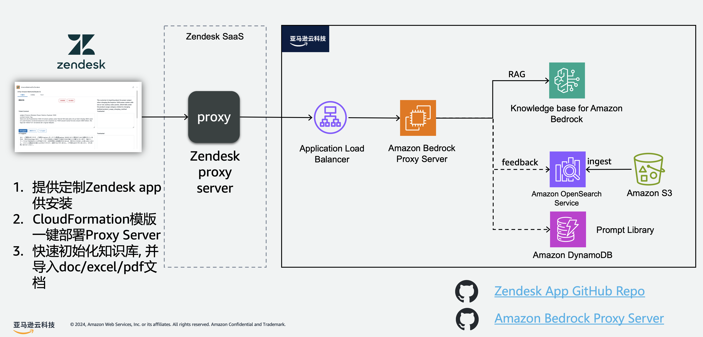

*Use of this software is subject to important terms and conditions as set forth in the License file*

# 基于 Amazon Bedrock 构建客服知识库，扩展Zendesk客服工作台, 赋能客户伴业务腾飞

## 方案场景

1. 面向客服团队, 提高客服回复效率。

2. 通过定制Zendesk app扩展客服工作台, 打通Amazon Bedrock知识库, 客户在打开Ticket的时候自动生成回复, 客服审阅并采用AI回复。

3. App基于提供翻译入口, 帮助客服人员理解来自非母语地区的咨询和内容回复。

4. 提供反馈机制, 客服人员选择use it 或者 need improve, 为知识库优化提供经验数据。

## Amazon Bedrock知识库& Claude 3 方案优势

1. 快速通过Amazon Bedrock Knowledge base提供知识库能力, 无预付费, 启用成本低。

2. 采用Amazon Bedrock内置Embedding模型, 支持日语、英语客服市场。

3. 基于Knowledge base的metadata filter能力, 提供基于ticket brand等label的准确召回过滤。

4. 采用Claude 3 Sonnet智能识别咨询意图, 为不同渠道(邮件、Chat等)提供预设回复格式和基于意图的不同回复。

5. Claude3支持多语言理解能力（MGSM），为面向日语、德语、英语等不同市场的客服提供统一的AI能力。

> 开箱即用、端到端托管的RAG工作流 

## 工作流

1. 根据提供的意图分类, 使用Claude 3识别客户咨询意图(售前、售后、复购、换货等)

2. 基于Amazon Bedrock知识库提供基础回复

3. 根据意图匹配定制的rewrite prompt, 提供不同语气、格式的回复.

4. 记录客服是否采纳AI回复以及未采纳的具体原因, 反馈分析, 提高文档质量

## 工作台展示

## 架构说明

## 安装说明

[install](./zendesk_install.md)

## 参考链接

[Knowledge Bases for Amazon Bedrock - 完全托管支持的端到端RAG](https://aws.amazon.com/cn/bedrock/knowledge-bases/)

[Amazon Bedrock 知识库支持元数据过滤以提高检索准确性](https://aws.amazon.com/cn/blogs/machine-learning/knowledge-bases-for-amazon-bedrock-now-supports-metadata-filtering-to-improve-retrieval-accuracy/)

[Amazon Text Embeddings V2, 一款轻量级、高效的模型，非常适合不同维度的高准确度检索任务](https://aws.amazon.com/cn/about-aws/whats-new/2024/04/amazon-titan-text-embeddings-v2-amazon-bedrock/)

### Zendesk App 开发相关

- https://developer.zendesk.com/
- https://github.com/zendesk/zendesk_apps_tools
- https://webpack.github.io
- https://developer.zendesk.com/documentation/apps/build-an-app/using-react-in-a-support-app/

## Copyright and license

Licensed under the Apache License, Version 2.0 (the "License"); you may not use this file except in compliance with the License.

You may obtain a copy of the License at
http://www.apache.org/licenses/LICENSE-2.0
Unless required by applicable law or agreed to in writing, software distributed under the License is distributed on an "AS IS" BASIS, WITHOUT WARRANTIES OR CONDITIONS OF ANY KIND, either express or implied. See the License for the specific language governing permissions and limitations under the License.
